# Hotels

## Features

### Hotel Results Display

- ✅ Retrieve hotel information and prices and display as I see fit.
- ✅ If hotel result don't have price, show "Rates Unavailable" and push it to the bottom of list
- ✅ If prices exist without hotel details, do not show.

|                                          |
| ---------------------------------------- |
| 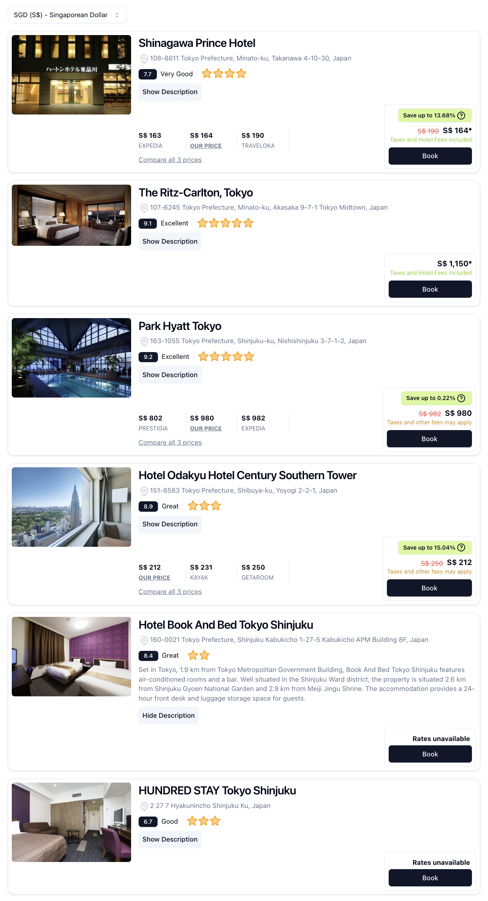 |

### Currency Selection

- ✅ Allow users to switch currencies and display prices based on selected currency
- ✅ Refreshing the page should show the last currency selected
- ✅ Default currency to USD if no currency was last selected.

|                                             |                                             |
| ------------------------------------------- | ------------------------------------------- |
| 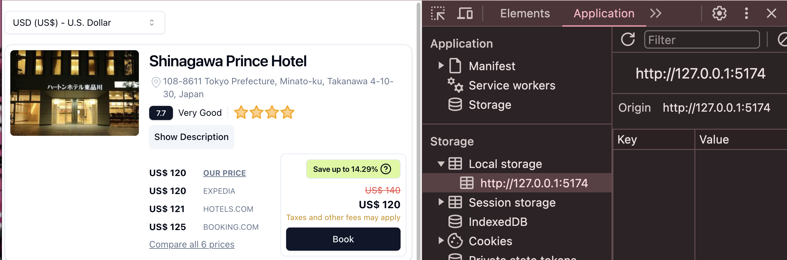 | 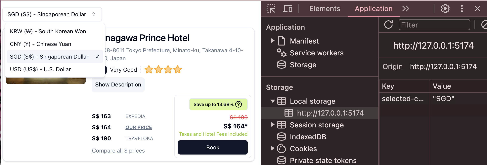 |

### Price Rounding Based on Currency

- ✅ Prices are rounded. USD, SGD, CNY are rounded to the nearest dollar. KRW, JPY, IDR rounded to the nearest 100-dollars.

|                                         |                                         |                                         |                                         |
| --------------------------------------- | --------------------------------------- | --------------------------------------- | --------------------------------------- |
| 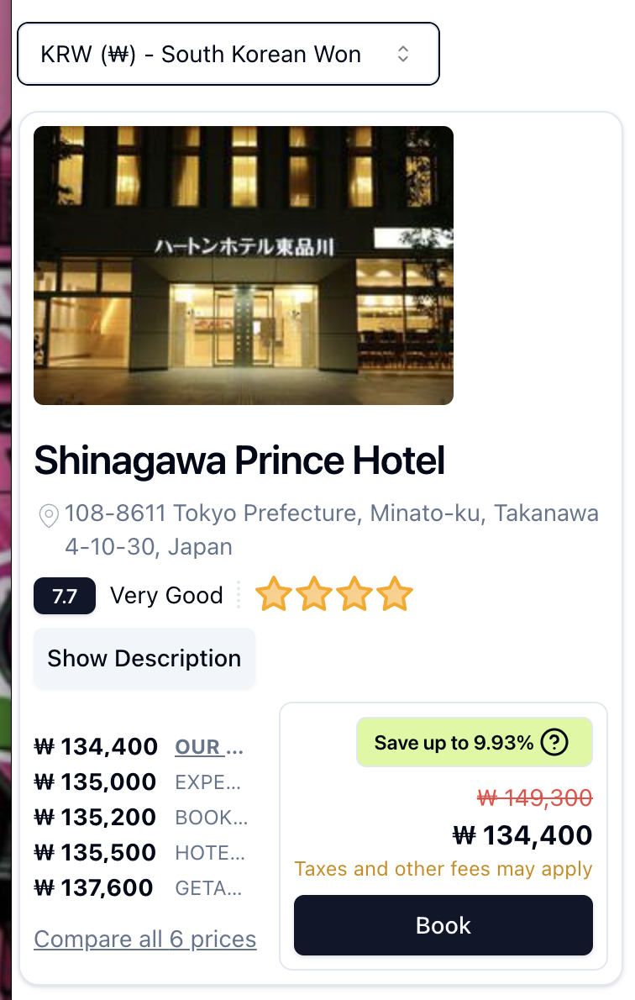 | 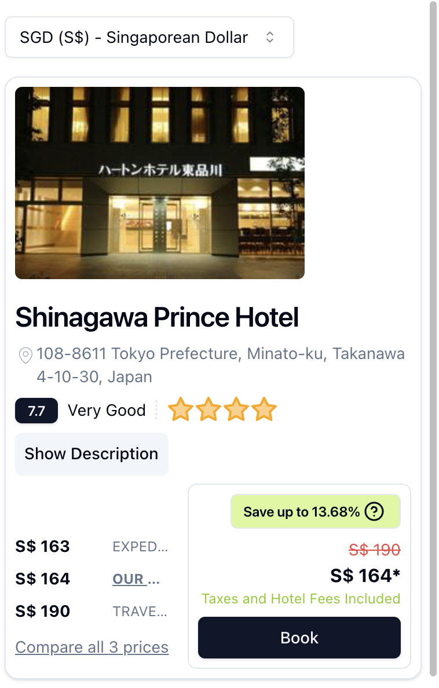 | 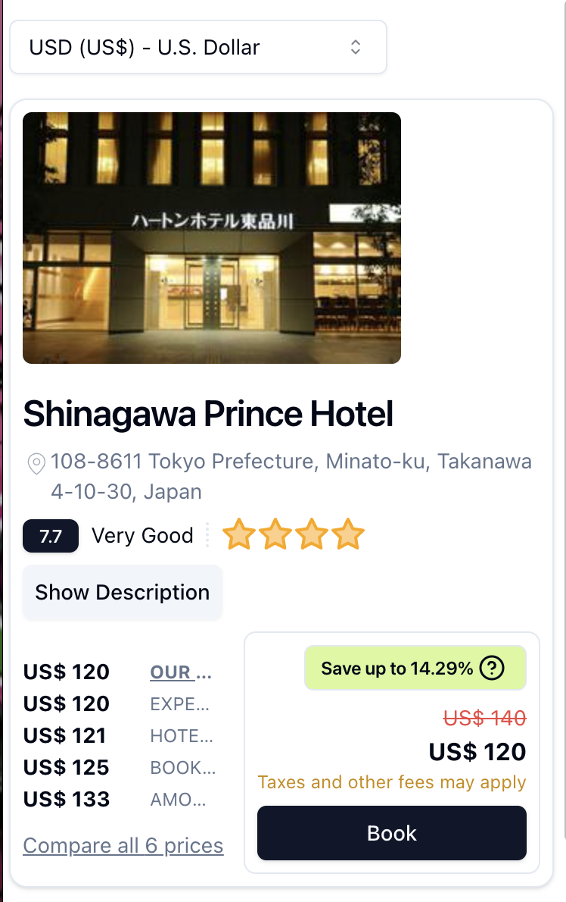 | 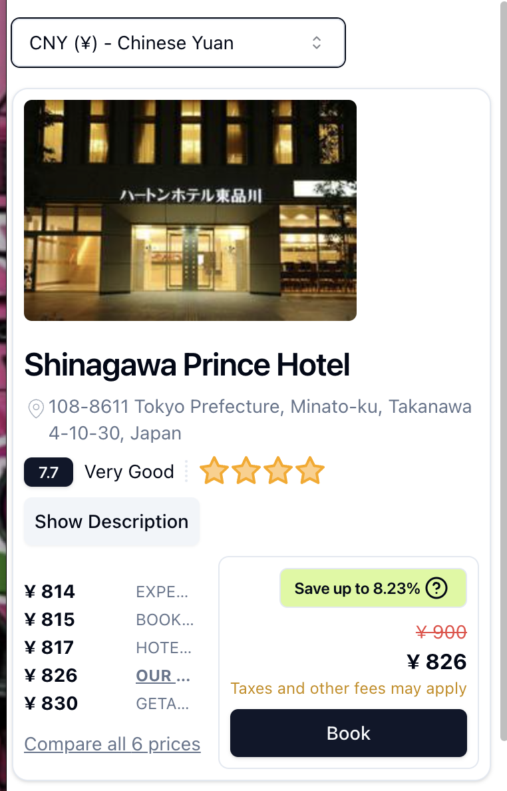 |

### Competitor Displays

- ✅ Display competitor rates within results, order from cheapest to most expensive.
- ✅ UI should work when there's no / too many competitions available.
- ✅ Also show our rates in the competition list.

|                                           |                                           |                                           |
| ----------------------------------------- | ----------------------------------------- | ----------------------------------------- |
| 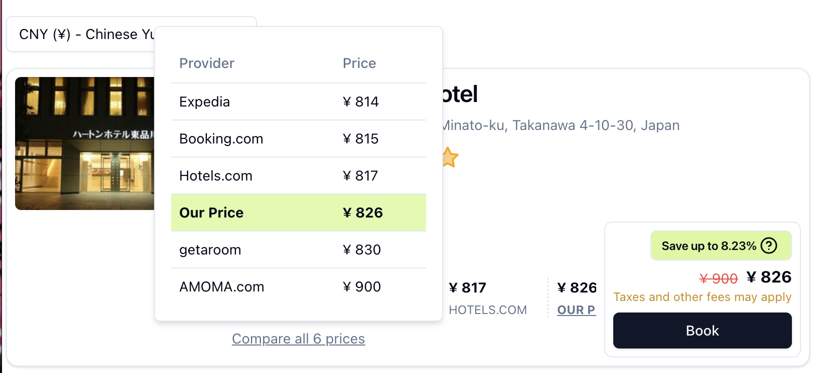 | 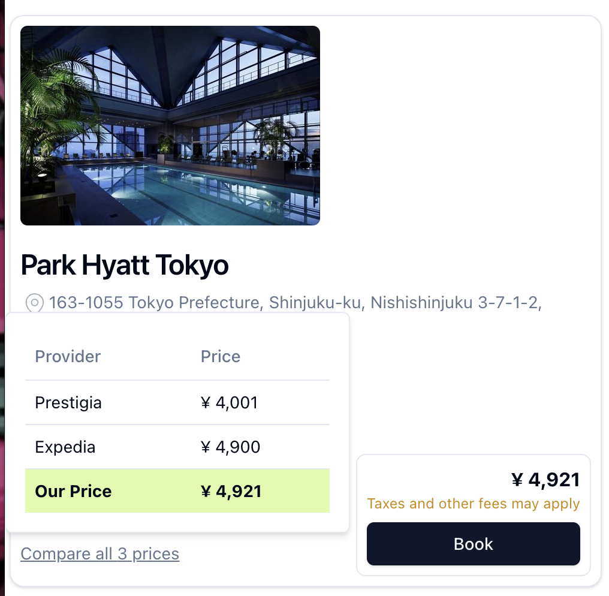 | 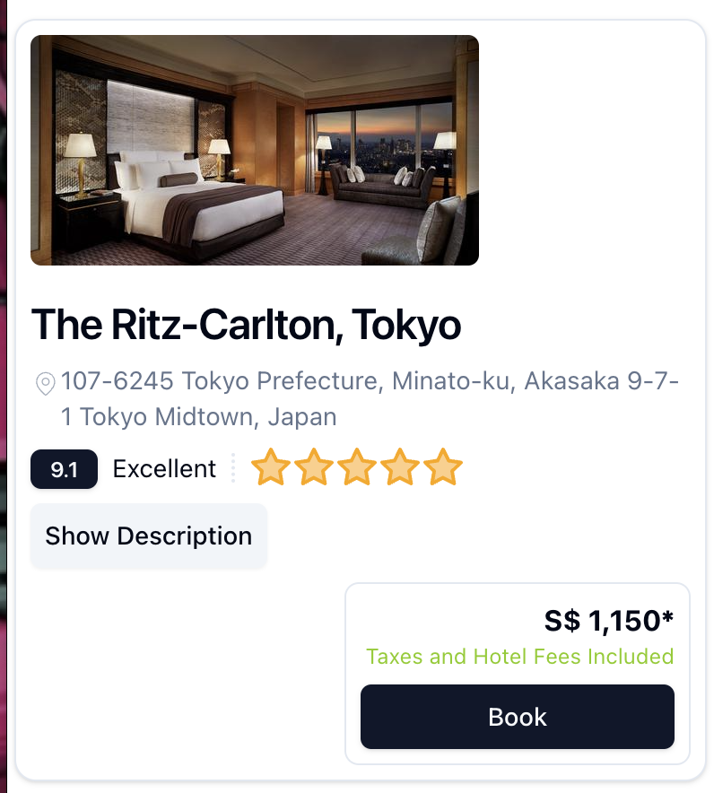 |

### Savings

- ✅ When applicable, should display "Save X%", if a more expensive competitor exists, show a strikethrough rate of the most expensive competitor price.

|                                  |
| -------------------------------- |
| 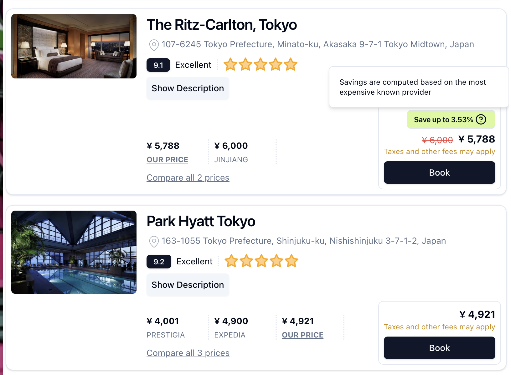 |

### Taxes and Fees

- ✅ When applicable, show an asterisk to indicate our price is tax-inclusive.
- ✅ On hover, pop-up displays the breakdown of the rates.
- ✅ If tax and fees are given that means the current price is tax-inclusive and this should be highlighted

|                                         |
| --------------------------------------- |
| 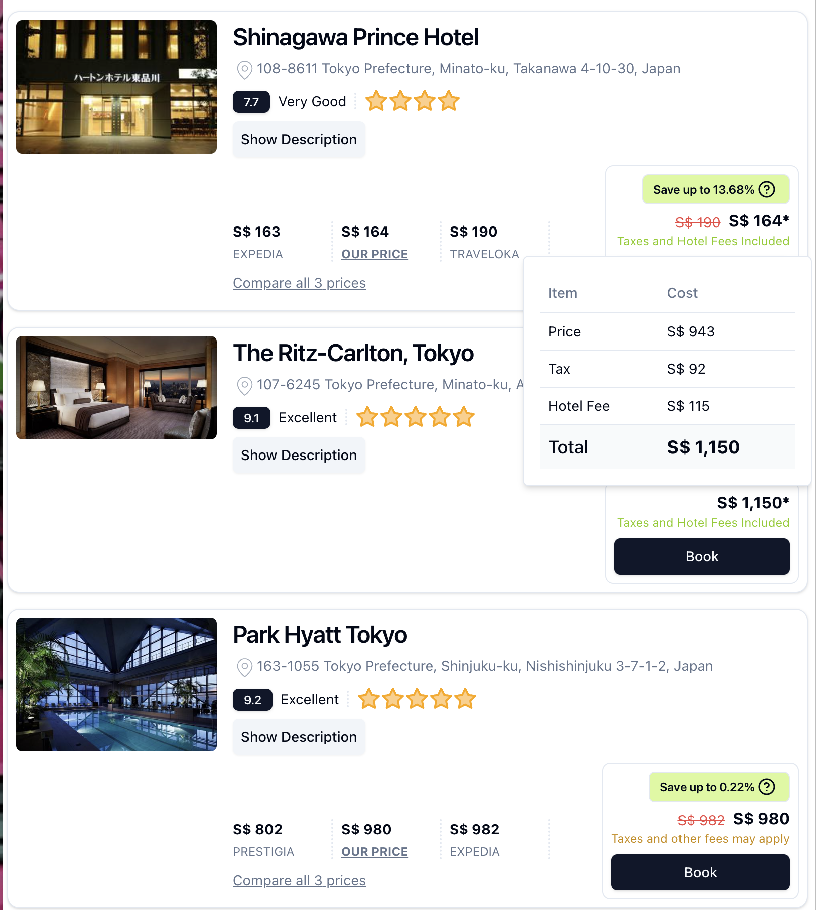 |

## Expectations

- Correctness, write and run tests
- Readability, easy to understand
- Consistency - 2 similar use cases / displays, centralized handling
- Testing - Emphasize having tests to ensure reliable code, write specs for essential logic in your features

[Specifications](https://gist.github.com/mal90/4627e6beb44ec038b90f64ea1bb30638)
